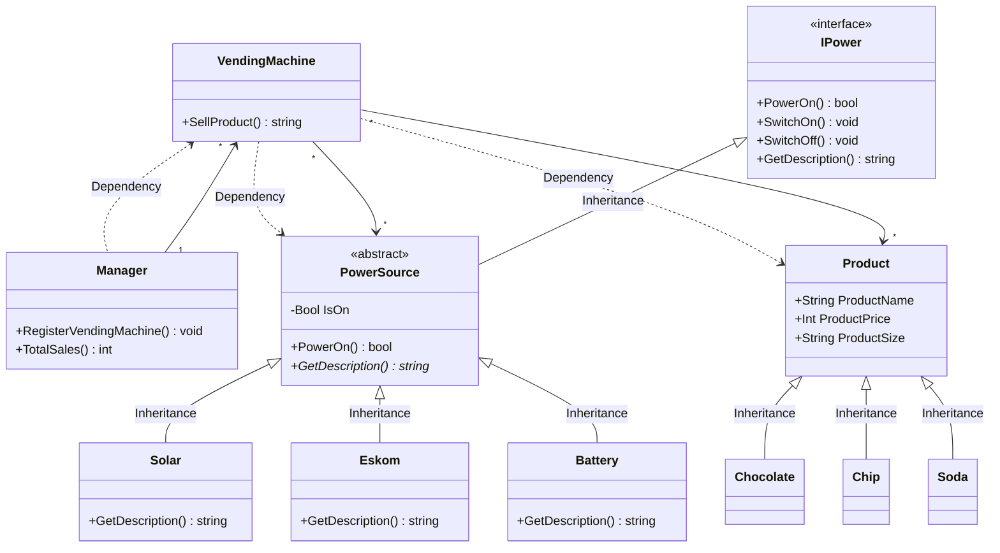

```mermaid
	classDiagram
	%% Creating my Vending machine Class diagram
	
	VendingMachine  <..  Manager : Dependency
	VendingMachine "*" <-- "1" Manager
	VendingMachine  ..>  PowerSource : Dependency
	VendingMachine  "*" --> "*" PowerSource
	VendingMachine ..>  Product : Dependency
	VendingMachine "*" --> "*" Product
	VendingMachine : +SellProduct() string
	
	class Manager{
		+RegisterVendingMachine() void
		+TotalSales() int
	}
	Product <|-- Chocolate : Inheritance
    Product <|-- Chip : Inheritance
    Product <|-- Soda : Inheritance
    Product : +String ProductName
    Product : +Int ProductPrice
    Product : +String ProductSize
	
	class IPower
	<<interface>> IPower
	IPower <|-- PowerSource : Inheritance
	IPower : +PowerOn() bool
	IPower: +SwitchOn() void
	IPower: +SwitchOff() void
	IPower: +GetDescription() string
	
	class PowerSource
	<<abstract>> PowerSource
	PowerSource <|-- Solar : Inheritance
	PowerSource <|-- Eskom : Inheritance
	PowerSource <|-- Battery : Inheritance
	PowerSource : -Bool IsOn
	PowerSource : +PowerOn() bool
	PowerSource : +GetDescription()* string
	
	class Solar{
		+GetDescription() string
	}
	class Eskom{
		+GetDescription() string
	}
	class Battery{
		+GetDescription() string
	}
```